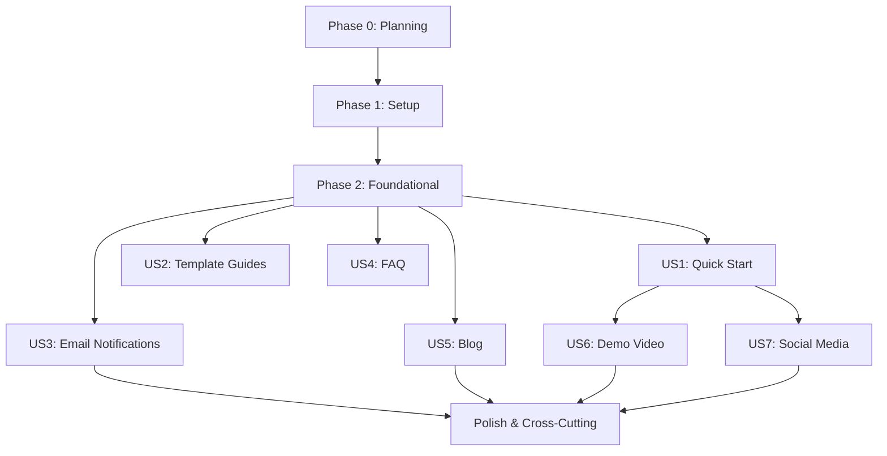

# Tasks: Documentation & Content Module

**Input**: Design documents from `/specs/001-docs-content/`
**Prerequisites**: plan.md ✅, spec.md ✅, research.md ✅, data-model.md ✅, contracts/email-api.yaml ✅

**Tests**: Not explicitly requested in spec - tests are OPTIONAL for this feature

**Organization**: Tasks are grouped by user story (7 stories total) to enable independent implementation and testing of each story.

## Format: `[ID] [P?] [Story] Description`

- **[P]**: Can run in parallel (different files, no dependencies)
- **[Story]**: Which user story this task belongs to (US1-US7)
- All tasks include exact file paths

## Path Conventions

This is a **web application** with:
- Backend: `/home/alex/PycharmProjects/viably/backend/src/`
- Frontend: `/home/alex/PycharmProjects/viably/frontend/`
- Content: `/home/alex/PycharmProjects/viably/frontend/content/`

---

## Phase 0: Planning (Executor Assignment)

**Purpose**: Prepare for implementation by analyzing requirements, creating necessary agents, and assigning executors.

- [X] P001 Analyze all tasks and identify required agent types and capabilities [EXECUTOR: MAIN] [COMPLETED]
→ Artifacts: Created 2 new agents: content-writer-specialist, react-email-specialist
- [X] P002 Create missing agents using meta-agent-v3 (launch N calls in single message, 1 per agent), then ask user restart [EXECUTOR: MAIN] [COMPLETED]
→ Artifacts: [content-writer-specialist](.claude/agents/content/workers/content-writer-specialist.md), [react-email-specialist](.claude/agents/frontend/workers/react-email-specialist.md)
- [X] P003 Assign executors to all tasks: MAIN (trivial only), existing agents (100% match), or specific agent names [EXECUTOR: MAIN] [COMPLETED]
→ Artifacts: Updated tasks.md with executor assignments for all 79 tasks + parallel grouping annotations
- [X] P004 Resolve research tasks: simple (solve with tools now), complex (create prompts in research/) [EXECUTOR: MAIN] [COMPLETED]
→ Note: No complex research needed - all decisions documented in research.md

**Rules**:
- **MAIN executor**: ONLY for trivial tasks (1-2 line fixes, simple imports, single npm install)
- **Existing agents**: ONLY if 100% capability match after thorough examination
- **Agent creation**: Launch all meta-agent-v3 calls in single message for parallel execution
- **After P002**: Must restart claude-code before proceeding to P003

**Artifacts**:
- Updated tasks.md with [EXECUTOR: name], [SEQUENTIAL]/[PARALLEL-GROUP-X] annotations
- .claude/agents/{domain}/{type}/{name}.md (if new agents created)
- research/*.md (if complex research identified)

---

## Phase 1: Setup (Shared Infrastructure)

**Purpose**: Project initialization - install libraries and configure MDX/Email systems

- [ ] T001 Install @next/mdx and MDX dependencies in /home/alex/PycharmProjects/viably/frontend/package.json [EXECUTOR: MAIN] [PARALLEL-GROUP-1]
- [ ] T002 Configure Next.js for MDX support in /home/alex/PycharmProjects/viably/frontend/next.config.ts [EXECUTOR: fullstack-nextjs-specialist] [SEQUENTIAL]
- [ ] T003 [P] Install react-email and @react-email/components in /home/alex/PycharmProjects/viably/frontend/package.json [EXECUTOR: MAIN] [PARALLEL-GROUP-1]
- [ ] T004 [P] Install resend Python SDK in /home/alex/PycharmProjects/viably/backend/pyproject.toml [EXECUTOR: MAIN] [PARALLEL-GROUP-1]
- [ ] T005 Create content directories: /home/alex/PycharmProjects/viably/frontend/content/docs/, /content/blog/, /content/social/ [EXECUTOR: MAIN] [PARALLEL-GROUP-1]
- [ ] T006 Create email templates directory: /home/alex/PycharmProjects/viably/frontend/emails/ and /emails/components/ [EXECUTOR: MAIN] [PARALLEL-GROUP-1]

---

## Phase 2: Foundational (Blocking Prerequisites)

**Purpose**: Core database schema and email service infrastructure that ALL user stories depend on

**⚠️ CRITICAL**: No user story work can begin until this phase is complete

- [ ] T007 Create database migration /home/alex/PycharmProjects/viably/backend/alembic/versions/001_create_email_logs.py [EXECUTOR: api-builder] [SEQUENTIAL]
- [ ] T008 Run alembic migration to create email_logs table in PostgreSQL [EXECUTOR: MAIN] [SEQUENTIAL]
- [ ] T009 Create EmailLog SQLAlchemy model in /home/alex/PycharmProjects/viably/backend/src/models/email_log.py [EXECUTOR: api-builder] [PARALLEL-GROUP-2]
- [ ] T010 Create EmailService class in /home/alex/PycharmProjects/viably/backend/src/services/email_service.py [EXECUTOR: api-builder] [PARALLEL-GROUP-2]
- [ ] T011 Add RESEND_API_KEY to /home/alex/PycharmProjects/viably/backend/.env and settings [EXECUTOR: MAIN] [PARALLEL-GROUP-2]
- [ ] T012 Create email API endpoints in /home/alex/PycharmProjects/viably/backend/src/api/v1/emails.py [EXECUTOR: api-builder] [PARALLEL-GROUP-2]
- [ ] T013 Create Celery task for async email sending in /home/alex/PycharmProjects/viably/backend/src/celery_tasks/email_tasks.py [EXECUTOR: api-builder] [PARALLEL-GROUP-2]

**Checkpoint**: Foundation ready - user story implementation can now begin in parallel

---

## Phase 3: User Story 1 - Quick Start Documentation (Priority: P1) 🎯 MVP

**Goal**: New users can access Quick Start guide with step-by-step instructions and screenshots for creating their first bot

**Independent Test**: Open /docs/quickstart page, verify all 5 steps are visible with screenshots, verify page renders correctly with proper SEO metadata

### Implementation for User Story 1

- [ ] T014 [P] [US1] Create MDX components for documentation in /home/alex/PycharmProjects/viably/frontend/src/components/mdx/ (Heading, CodeBlock, Image) [EXECUTOR: fullstack-nextjs-specialist] [PARALLEL-GROUP-3]
- [ ] T015 [P] [US1] Create documentation layout component in /home/alex/PycharmProjects/viably/frontend/src/app/docs/layout.tsx [EXECUTOR: fullstack-nextjs-specialist] [PARALLEL-GROUP-3]
- [ ] T016 [US1] Create dynamic doc page in /home/alex/PycharmProjects/viably/frontend/src/app/docs/[slug]/page.tsx with MDX compilation and metadata generation [EXECUTOR: fullstack-nextjs-specialist] [SEQUENTIAL]
- [ ] T017 [US1] Write Quick Start MDX content in /home/alex/PycharmProjects/viably/frontend/content/docs/quickstart.mdx with frontmatter and 5 steps [EXECUTOR: content-writer-specialist] [SEQUENTIAL]
- [ ] T018 [US1] Create placeholder screenshots directory /home/alex/PycharmProjects/viably/frontend/public/docs/screenshots/ and add placeholder images [EXECUTOR: MAIN] [SEQUENTIAL]
- [ ] T019 [US1] Add navigation links to Quick Start from landing page and dashboard [EXECUTOR: MAIN] [SEQUENTIAL]

**Checkpoint**: Quick Start page is accessible, renders correctly, and contains all required content

---

## Phase 4: User Story 2 - Template-Specific Guides (Priority: P1) 🎯 MVP

**Goal**: Users can access detailed guides for each of 6 bot templates explaining parameters and configuration

**Independent Test**: Open /docs/templates/shop-bot page, verify template description, parameters, examples, and customization instructions are present

### Implementation for User Story 2

- [ ] T020 [P] [US2] Create dynamic template guide page in /home/alex/PycharmProjects/viably/frontend/src/app/docs/templates/[slug]/page.tsx [EXECUTOR: fullstack-nextjs-specialist] [PARALLEL-GROUP-4]
- [ ] T021 [P] [US2] Write Shop Bot guide in /home/alex/PycharmProjects/viably/frontend/content/docs/templates/shop-bot.mdx [EXECUTOR: content-writer-specialist] [PARALLEL-GROUP-4]
- [ ] T022 [P] [US2] Write FAQ Bot guide in /home/alex/PycharmProjects/viably/frontend/content/docs/templates/faq-bot.mdx [EXECUTOR: content-writer-specialist] [PARALLEL-GROUP-4]
- [ ] T023 [P] [US2] Write Support Bot guide in /home/alex/PycharmProjects/viably/frontend/content/docs/templates/support-bot.mdx [EXECUTOR: content-writer-specialist] [PARALLEL-GROUP-4]
- [ ] T024 [P] [US2] Write Booking Bot guide in /home/alex/PycharmProjects/viably/frontend/content/docs/templates/booking-bot.mdx [EXECUTOR: content-writer-specialist] [PARALLEL-GROUP-4]
- [ ] T025 [P] [US2] Write Poll Bot guide in /home/alex/PycharmProjects/viably/frontend/content/docs/templates/poll-bot.mdx [EXECUTOR: content-writer-specialist] [PARALLEL-GROUP-4]
- [ ] T026 [P] [US2] Write Notifications Bot guide in /home/alex/PycharmProjects/viably/frontend/content/docs/templates/notifications-bot.mdx [EXECUTOR: content-writer-specialist] [PARALLEL-GROUP-4]
- [ ] T027 [US2] Create template guides navigation in /home/alex/PycharmProjects/viably/frontend/src/components/docs/TemplateNav.tsx [EXECUTOR: fullstack-nextjs-specialist] [SEQUENTIAL]
- [ ] T028 [US2] Add links to template guides from template selection page [EXECUTOR: fullstack-nextjs-specialist] [SEQUENTIAL]

**Checkpoint**: All 6 template guides are accessible and contain complete information

---

## Phase 5: User Story 3 - Email Notifications (Priority: P1) 🎯 MVP

**Goal**: Users receive automated emails at key moments (registration, generation complete, deploy success, low credits)

**Independent Test**: Trigger registration event, verify Welcome Email is sent via Resend API and logged in email_logs table with status SENT

### Implementation for User Story 3

- [ ] T029 [P] [US3] Create shared email components: Button in /home/alex/PycharmProjects/viably/frontend/emails/components/Button.tsx [EXECUTOR: react-email-specialist] [PARALLEL-GROUP-5]
- [ ] T030 [P] [US3] Create shared email components: Container in /home/alex/PycharmProjects/viably/frontend/emails/components/Container.tsx [EXECUTOR: react-email-specialist] [PARALLEL-GROUP-5]
- [ ] T031 [P] [US3] Create shared email components: Header in /home/alex/PycharmProjects/viably/frontend/emails/components/Header.tsx [EXECUTOR: react-email-specialist] [PARALLEL-GROUP-5]
- [ ] T032 [P] [US3] Create WelcomeEmail template in /home/alex/PycharmProjects/viably/frontend/emails/WelcomeEmail.tsx with props interface [EXECUTOR: react-email-specialist] [PARALLEL-GROUP-6]
- [ ] T033 [P] [US3] Create GenerationCompleteEmail template in /home/alex/PycharmProjects/viably/frontend/emails/GenerationCompleteEmail.tsx [EXECUTOR: react-email-specialist] [PARALLEL-GROUP-6]
- [ ] T034 [P] [US3] Create DeploySuccessEmail template in /home/alex/PycharmProjects/viably/frontend/emails/DeploySuccessEmail.tsx [EXECUTOR: react-email-specialist] [PARALLEL-GROUP-6]
- [ ] T035 [P] [US3] Create LowCreditsWarning template in /home/alex/PycharmProjects/viably/frontend/emails/LowCreditsWarning.tsx [EXECUTOR: react-email-specialist] [PARALLEL-GROUP-6]
- [ ] T036 [US3] Update EmailService to render React Email templates in /home/alex/PycharmProjects/viably/backend/src/services/email_service.py [EXECUTOR: api-builder] [SEQUENTIAL]
- [ ] T037 [US3] Add email template HTML rendering utility in /home/alex/PycharmProjects/viably/backend/src/services/email_renderer.py [EXECUTOR: api-builder] [SEQUENTIAL]
- [ ] T038 [US3] Integrate email sending on user registration event in /home/alex/PycharmProjects/viably/backend/src/api/v1/auth.py [EXECUTOR: api-builder] [PARALLEL-GROUP-7]
- [ ] T039 [US3] Integrate email sending on bot generation complete event in /home/alex/PycharmProjects/viably/backend/src/api/v1/projects.py [EXECUTOR: api-builder] [PARALLEL-GROUP-7]
- [ ] T040 [US3] Integrate email sending on deploy success event in /home/alex/PycharmProjects/viably/backend/src/api/v1/deploy.py [EXECUTOR: api-builder] [PARALLEL-GROUP-7]
- [ ] T041 [US3] Implement low credits check and email trigger in /home/alex/PycharmProjects/viably/backend/src/services/credits_service.py [EXECUTOR: api-builder] [PARALLEL-GROUP-7]
- [ ] T042 [US3] Add email retry logic with exponential backoff in Celery task in /home/alex/PycharmProjects/viably/backend/src/celery_tasks/email_tasks.py [EXECUTOR: api-builder] [PARALLEL-GROUP-7]

**Checkpoint**: All 4 email types are sent correctly, logged in database, with proper error handling and retries

---

## Phase 6: User Story 4 - FAQ Documentation (Priority: P2)

**Goal**: Potential users can find quick answers to common questions about Viably

**Independent Test**: Open /docs/faq page, verify 8+ questions are present with clear answers

### Implementation for User Story 4

- [ ] T043 [US4] Write FAQ MDX content in /home/alex/PycharmProjects/viably/frontend/content/docs/faq.mdx with 8+ questions and answers [EXECUTOR: content-writer-specialist] [SEQUENTIAL]
- [ ] T044 [US4] Add FAQ page link to documentation navigation and footer [EXECUTOR: MAIN] [SEQUENTIAL]

**Checkpoint**: FAQ page is accessible with complete content answering common questions

---

## Phase 7: User Story 5 - Blog Content for SEO & Marketing (Priority: P2)

**Goal**: Blog posts attract organic traffic from search engines and convert readers to users

**Independent Test**: Open /blog/create-telegram-bot-60-seconds page, verify SEO metadata, content, and CTA are present

### Implementation for User Story 5

- [ ] T045 [P] [US5] Create blog layout component in /home/alex/PycharmProjects/viably/frontend/src/app/blog/layout.tsx [EXECUTOR: fullstack-nextjs-specialist] [PARALLEL-GROUP-8]
- [ ] T046 [P] [US5] Create blog index page in /home/alex/PycharmProjects/viably/frontend/src/app/blog/page.tsx listing all posts [EXECUTOR: fullstack-nextjs-specialist] [PARALLEL-GROUP-8]
- [ ] T047 [US5] Create dynamic blog post page in /home/alex/PycharmProjects/viably/frontend/src/app/blog/[slug]/page.tsx with SEO metadata [EXECUTOR: fullstack-nextjs-specialist] [SEQUENTIAL]
- [ ] T048 [P] [US5] Write blog post "Как создать Telegram-бота за 60 секунд" in /home/alex/PycharmProjects/viably/frontend/content/blog/create-telegram-bot-60-seconds.mdx (1000-1500 words) [EXECUTOR: content-writer-specialist] [PARALLEL-GROUP-9]
- [ ] T049 [P] [US5] Write blog post "5 идей Telegram-ботов для малого бизнеса" in /home/alex/PycharmProjects/viably/frontend/content/blog/telegram-bot-ideas-small-business.mdx (1500-2000 words) [EXECUTOR: content-writer-specialist] [PARALLEL-GROUP-9]
- [ ] T050 [P] [US5] Write blog post "Мы запустили Viably" in /home/alex/PycharmProjects/viably/frontend/content/blog/viably-launch-announcement.mdx (800-1200 words) [EXECUTOR: content-writer-specialist] [PARALLEL-GROUP-9]
- [ ] T051 [US5] Generate sitemap.xml for blog posts in /home/alex/PycharmProjects/viably/frontend/src/app/sitemap.ts [EXECUTOR: fullstack-nextjs-specialist] [SEQUENTIAL]
- [ ] T052 [US5] Add blog link to landing page and footer navigation [EXECUTOR: fullstack-nextjs-specialist] [SEQUENTIAL]

**Checkpoint**: All 3 blog posts are published with proper SEO, indexed by search engines (verify with Google Search Console)

---

## Phase 8: User Story 6 - Demo Video (Priority: P3)

**Goal**: Landing page visitors can watch demo video to quickly understand how Viably works

**Independent Test**: Open landing page, verify video player loads, plays YouTube video on click (lazy loading)

### Implementation for User Story 6

- [ ] T053 [US6] Record demo video (2 minutes) showing registration → template selection → configuration → generation → deploy [EXECUTOR: visual-effects-creator] [SEQUENTIAL]
- [ ] T054 [US6] Upload demo video to YouTube channel with title, description, and tags [EXECUTOR: visual-effects-creator] [SEQUENTIAL]
- [ ] T055 [US6] Create LiteYouTube component in /home/alex/PycharmProjects/viably/frontend/src/components/video/LiteYouTube.tsx with lazy loading [EXECUTOR: fullstack-nextjs-specialist] [SEQUENTIAL]
- [ ] T056 [US6] Add NEXT_PUBLIC_YOUTUBE_VIDEO_ID to /home/alex/PycharmProjects/viably/frontend/.env [EXECUTOR: MAIN] [SEQUENTIAL]
- [ ] T057 [US6] Embed demo video on landing page in /home/alex/PycharmProjects/viably/frontend/src/app/page.tsx [EXECUTOR: fullstack-nextjs-specialist] [PARALLEL-GROUP-10]
- [ ] T058 [US6] Embed demo video on Quick Start page in /home/alex/PycharmProjects/viably/frontend/content/docs/quickstart.mdx [EXECUTOR: fullstack-nextjs-specialist] [PARALLEL-GROUP-10]

**Checkpoint**: Demo video is embedded on landing page and Quick Start page, loads quickly with lazy loading

---

## Phase 9: User Story 7 - Social Media Launch Assets (Priority: P3)

**Goal**: Viably team has all content ready for ProductHunt, Twitter, Reddit, Telegram launch

**Independent Test**: Verify all text content files exist in /content/social/, all visual assets exist in /public/social/

### Implementation for User Story 7

- [ ] T059 [P] [US7] Write ProductHunt submission text in /home/alex/PycharmProjects/viably/frontend/content/social/producthunt.md (tagline, description, maker comment) [EXECUTOR: content-writer-specialist] [PARALLEL-GROUP-11]
- [ ] T060 [P] [US7] Write Twitter launch thread in /home/alex/PycharmProjects/viably/frontend/content/social/twitter-thread.md (10 tweets) [EXECUTOR: content-writer-specialist] [PARALLEL-GROUP-11]
- [ ] T061 [P] [US7] Write Reddit launch post in /home/alex/PycharmProjects/viably/frontend/content/social/reddit-post.md for r/SideProject, r/NoCode, r/Telegram [EXECUTOR: content-writer-specialist] [PARALLEL-GROUP-11]
- [ ] T062 [P] [US7] Write Telegram announcement in /home/alex/PycharmProjects/viably/frontend/content/social/telegram-announcement.md (Russian) [EXECUTOR: content-writer-specialist] [PARALLEL-GROUP-11]
- [ ] T063 [US7] Create ProductHunt screenshots directory /home/alex/PycharmProjects/viably/frontend/public/social/producthunt/ [EXECUTOR: MAIN] [SEQUENTIAL]
- [ ] T064 [P] [US7] Take screenshot 1: Landing page hero in /public/social/producthunt/screenshot-1.png [EXECUTOR: visual-effects-creator] [PARALLEL-GROUP-12]
- [ ] T065 [P] [US7] Take screenshot 2: Template gallery in /public/social/producthunt/screenshot-2.png [EXECUTOR: visual-effects-creator] [PARALLEL-GROUP-12]
- [ ] T066 [P] [US7] Take screenshot 3: Generation flow in /public/social/producthunt/screenshot-3.png [EXECUTOR: visual-effects-creator] [PARALLEL-GROUP-12]
- [ ] T067 [P] [US7] Take screenshot 4: Deploy success in /public/social/producthunt/screenshot-4.png [EXECUTOR: visual-effects-creator] [PARALLEL-GROUP-12]
- [ ] T068 [P] [US7] Take screenshot 5: Dashboard in /public/social/producthunt/screenshot-5.png [EXECUTOR: visual-effects-creator] [PARALLEL-GROUP-12]
- [ ] T069 [US7] Create demo GIF for social media in /home/alex/PycharmProjects/viably/frontend/public/social/producthunt/demo.gif (10-15 seconds loop) [EXECUTOR: visual-effects-creator] [SEQUENTIAL]
- [ ] T070 [US7] Copy demo GIF to Twitter directory /home/alex/PycharmProjects/viably/frontend/public/social/twitter/demo.gif [EXECUTOR: MAIN] [SEQUENTIAL]

**Checkpoint**: All social media text and visual assets are ready for launch

---

## Phase 10: Polish & Cross-Cutting Concerns

**Purpose**: Final touches, performance optimization, and documentation

- [ ] T071 [P] Run Lighthouse CI audit on /docs/quickstart and verify score > 90 [EXECUTOR: MAIN] [PARALLEL-GROUP-13]
- [ ] T072 [P] Run Lighthouse CI audit on /blog/create-telegram-bot-60-seconds and verify score > 90 [EXECUTOR: MAIN] [PARALLEL-GROUP-13]
- [ ] T073 [P] Verify email delivery rate in Resend dashboard (should be > 95%) [EXECUTOR: MAIN] [PARALLEL-GROUP-13]
- [ ] T074 Create maintenance documentation in /home/alex/PycharmProjects/viably/docs/maintenance/content-updates.md [EXECUTOR: MAIN] [SEQUENTIAL]
- [ ] T075 Create maintenance documentation in /home/alex/PycharmProjects/viably/docs/maintenance/email-troubleshooting.md [EXECUTOR: MAIN] [SEQUENTIAL]
- [ ] T076 [P] Run type-check on frontend: `cd frontend && npm run type-check` [EXECUTOR: MAIN] [PARALLEL-GROUP-14]
- [ ] T077 [P] Run type-check on backend: `cd backend && mypy src/` [EXECUTOR: MAIN] [PARALLEL-GROUP-14]
- [ ] T078 Build frontend to verify MDX compilation: `cd frontend && npm run build` [EXECUTOR: MAIN] [SEQUENTIAL]
- [ ] T079 Verify all environment variables are documented in .env.example files [EXECUTOR: MAIN] [SEQUENTIAL]

**Checkpoint**: All quality gates passed, documentation complete, ready for deployment

---

## Dependencies (User Story Completion Order)



**Key Dependencies**:
- **Phase 2 (Foundational)** MUST complete before ANY user story
- **US1, US2, US3** (P1 stories) can run in parallel after Phase 2
- **US4, US5** (P2 stories) can run in parallel after Phase 2
- **US6** (Demo Video) depends on US1 (needs Quick Start page for embedding)
- **US7** (Social Media) depends on US1 (needs app screenshots)
- **Polish** waits for US3, US5, US6, US7 to complete

---

## Parallel Execution Opportunities

### Phase 1: Setup (All Parallel)
```bash
# Parallel Group 1: Frontend packages
T001, T002, T003  # MDX and React Email installation

# Parallel Group 2: Backend packages
T004  # Resend SDK installation

# Parallel Group 3: Directory creation
T005, T006  # Content and email directories
```

### Phase 2: Foundational (Mixed)
```bash
# Sequential: Database migration
T007 → T008 → T009  # Must run in order

# Parallel after T009: Services
T010, T011, T012, T013  # Email service, API, Celery tasks
```

### Phase 3: US1 - Quick Start (Mixed)
```bash
# Parallel Group 1: Components
T014, T015  # MDX components and layout

# Sequential: Page implementation
T016 → T017 → T018 → T019  # Page depends on components
```

### Phase 4: US2 - Template Guides (Mostly Parallel)
```bash
# Parallel: All 6 template guides
T021, T022, T023, T024, T025, T026  # Independent MDX files

# Sequential: Navigation
T020 → T027 → T028  # Page → Navigation → Integration
```

### Phase 5: US3 - Email Notifications (Mixed)
```bash
# Parallel Group 1: Email components
T029, T030, T031  # Shared components

# Parallel Group 2: Email templates (depends on Group 1)
T032, T033, T034, T035  # All 4 email templates

# Sequential: Backend integration
T036 → T037 → T038  # Service → Renderer → Integration
T039, T040, T041, T042  # Event integrations (parallel)
```

### Phase 7: US5 - Blog (Mixed)
```bash
# Parallel Group 1: Blog infrastructure
T045, T046  # Layout and index

# Sequential: Blog posts
T047 → T048, T049, T050  # Page setup, then all posts in parallel

# Final: SEO
T051 → T052  # Sitemap → Navigation
```

### Phase 9: US7 - Social Media (Mostly Parallel)
```bash
# Parallel Group 1: Text content
T059, T060, T061, T062  # All social media texts

# Parallel Group 2: Screenshots (after T063)
T063 → T064, T065, T066, T067, T068  # Directory → All screenshots

# Final: GIFs
T069 → T070  # Demo GIF → Copy
```

---

## Implementation Strategy

### MVP Scope (Recommended for First Release)

**Include (P1 stories - critical for launch)**:
- ✅ User Story 1: Quick Start Documentation
- ✅ User Story 2: Template-Specific Guides
- ✅ User Story 3: Email Notifications

**Defer to V2 (P2/P3 stories - nice to have)**:
- ⏳ User Story 4: FAQ Documentation (can use Quick Start as temporary FAQ)
- ⏳ User Story 5: Blog Content (can launch without blog initially)
- ⏳ User Story 6: Demo Video (can embed later)
- ⏳ User Story 7: Social Media Assets (create when ready to launch publicly)

**Rationale**: MVP includes core documentation (Quick Start + Template Guides) and critical email notifications. This enables users to successfully create bots and receive feedback via email. Blog, FAQ, video, and social media can be added post-launch.

### Incremental Delivery Plan

1. **Sprint 1 (Week 1)**: Phase 0-2 (Setup + Foundational) → Email system working
2. **Sprint 2 (Week 1-2)**: US1 + US2 → Documentation live
3. **Sprint 3 (Week 2)**: US3 → Email notifications integrated
4. **MVP Release**: Deploy with US1, US2, US3 complete
5. **Sprint 4 (Week 3)**: US4 + US5 → FAQ and Blog added
6. **Sprint 5 (Week 4)**: US6 + US7 → Demo video and social media ready for public launch

---

## Task Summary

**Total Tasks**: 79 tasks across 11 phases

**Breakdown by Phase**:
- Phase 0: Planning - 4 tasks
- Phase 1: Setup - 6 tasks
- Phase 2: Foundational - 7 tasks
- Phase 3: US1 (Quick Start) - 6 tasks
- Phase 4: US2 (Template Guides) - 9 tasks
- Phase 5: US3 (Email Notifications) - 14 tasks
- Phase 6: US4 (FAQ) - 2 tasks
- Phase 7: US5 (Blog) - 8 tasks
- Phase 8: US6 (Demo Video) - 6 tasks
- Phase 9: US7 (Social Media) - 12 tasks
- Phase 10: Polish - 9 tasks

**Breakdown by User Story**:
- US1: 6 tasks (Quick Start Documentation)
- US2: 9 tasks (Template Guides)
- US3: 14 tasks (Email Notifications)
- US4: 2 tasks (FAQ)
- US5: 8 tasks (Blog)
- US6: 6 tasks (Demo Video)
- US7: 12 tasks (Social Media)
- Infrastructure: 17 tasks (Planning, Setup, Foundational)
- Polish: 9 tasks

**Parallel Opportunities**: 45 tasks marked [P] can run in parallel

**Independent Test Criteria**:
- US1: Quick Start page renders with 5 steps and screenshots
- US2: All 6 template guide pages render with complete content
- US3: All 4 email types send successfully and log in database
- US4: FAQ page renders with 8+ questions
- US5: All 3 blog posts render with proper SEO metadata
- US6: Demo video plays on landing page with lazy loading
- US7: All social media assets (text + visuals) exist in expected locations

**Format Validation**: ✅ All 79 tasks follow checklist format with checkbox, ID, [P]/[Story] labels, and file paths
